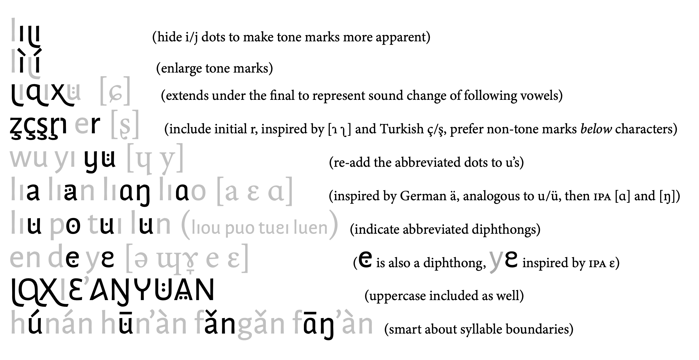

# Huānlè Sans · 欢乐无衬线 · 歡樂無襯線

Experimental Pinyin Font derived from [Alegreya Sans](https://github.com/huertatipografica/Alegreya-Sans).
I like to use it in my electronic dictionary.
Perhaps it could have some educational use?

You can apply this font to any existing standard pinyin text without needing to edit the text,
and assuming it is spelled correctly, everything will convert automatically.

Try it out for yourself [here](https://zidaizi.github.io/HuanleSans) (you can edit the text at the top of the page).

The goal is to preserve the basic shape of letters while
adding details that draw attention to some of the easily overlooked nuances in pronunciation.
Other scripts are used as inspiration, including official shorthand for symbols like ng,
but also unrelated scripts like German, Turkish and IPA.

## Installation

You can install on desktop by downloading [HuanleSansPinyin.otf](HuanleSansPinyin.otf).

Apple mobile devices can install by downloading [HuanleSansPinyin.mobileconfig](HuanleSansPinyin.mobileconfig) and first opening it,
then actually installing it through the Settings app → General → VPN, DNS & Service Management.
(It gives a bunch of scary warnings, but it’s just a text file you can edit *by hand, yourself* to install any font,
if you replace the data field with the .otf or .ttf file encoded as base64 and don’t collide the many ID fields.)

Android users, your systems vary, but you’re smart, you’ll figure it out.

There’s also a [HuanleSans.otf](HuanleSans.otf) and [HuanleSans.mobileconfig](HuanleSans.mobileconfig)
that doesn’t have the substitutions, if you just want the enlarged accents, or want to use it for something else.

## Technical details

Most of the magic happens in the contextual alternates OpenType feature.
The key to the logic there is that a correctly spelled pinyin syllable
will either be separated by spaces or punctuation, or start with a consonant or apostrophe,
which means any other vowels (and special cases for -r, -n and -ng, the only consonant finals) can be easily referenced and replaced.
